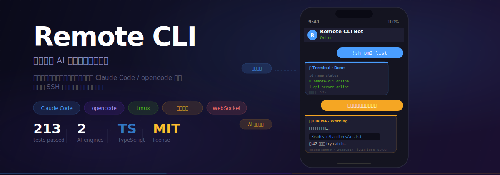
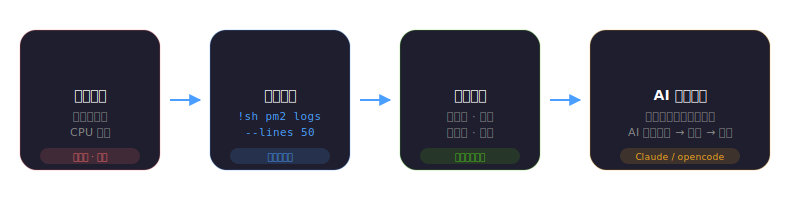
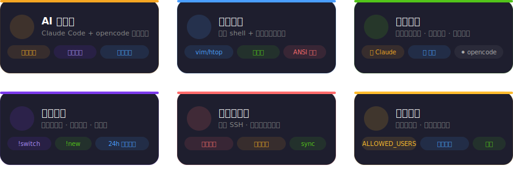
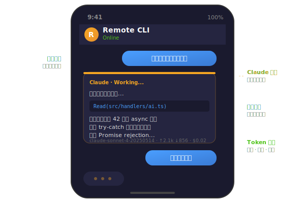
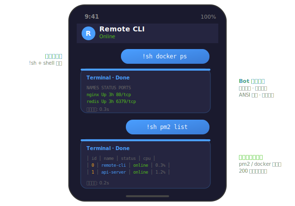
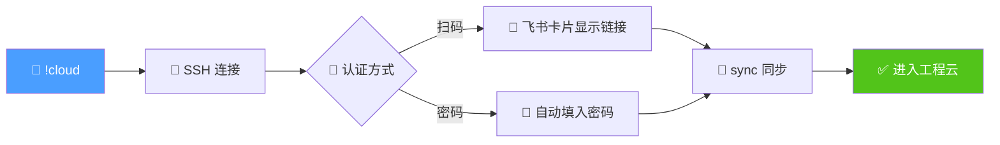
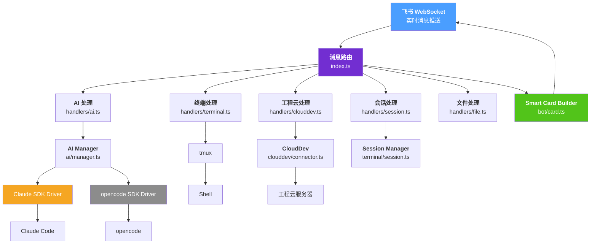

<div align="center">



<br/>

[](https://nodejs.org/)
[](https://www.typescriptlang.org/)
[](#)
[](LICENSE)

**在飞书里远程控制服务器、与 AI 编码助手对话、传输文件、一键连接工程云**

就像把 VS Code Terminal + AI Copilot 装进了飞书。不需要 SSH 客户端，一个飞书就够了。

[快速开始](#-快速开始) · [功能特性](#-功能特性) · [命令参考](#-命令参考) · [架构设计](#-架构设计) · [开发](#-开发)

</div>

<br/>

## 🎬 使用场景

<div align="center">



<br/>

> **地铁上收到告警？** 打开飞书 → 发一条消息 → 服务器就在你手里。查日志、重启服务、让 AI 分析报错，全在聊天窗口完成。

</div>

<br/>

---

## ✨ 功能特性

<div align="center">



</div>

<br/>

### 🤖 AI 双引擎

同时支持 **Claude Code** 和 **opencode** 两个 AI 编码助手，通过 SDK 获取结构化输出。

<div align="center">



</div>

<br/>

<table>
<tr>
<td width="50%">

**Claude Code 模式**
```
你：帮我看下 src/index.ts 的错误处理

Claude：我来检查一下...
  📖 Read(src/index.ts)
  找到 3 个问题：
  1. handleCommand 缺少 try-catch
  2. Promise rejection 未捕获
  3. 错误日志缺少 stack trace
```

</td>
<td width="50%">

**opencode 模式**
```
你：!oc 优化这段代码的性能

opencode：正在分析...
  🔍 分析调用链路
  ⚡ 发现 3 处优化点：
  1. 重复的 await 可以并行
  2. 缓存未命中率过高
  3. JSON 序列化可以延迟
```

</td>
</tr>
</table>

| 能力 | 说明 |
|:---:|:-----|
| 🔄 双后端切换 | `!claude` / `!opencode` 随时切换 |
| 🎯 模型热切 | `!model sonnet` — 支持 opus / sonnet / haiku / gemini / gpt 等 |
| ⚡ 流式输出 | AI 回复实时更新飞书卡片，不用等完整响应 |
| 🛡️ 工具权限 | Claude 使用工具前弹出权限确认卡片 |
| 💾 会话恢复 | Bot 重启后自动恢复上次 AI 对话上下文 |

<br/>

### 📁 文件传输

在飞书和服务器之间双向传输文件——发文件自动上传到服务器，`!dl` 把服务器文件发回飞书。

<table>
<tr>
<td width="50%">

**上传（飞书 → 服务器）**
```
你：[发送 screenshot.png]

Bot：File saved
     Path: ~/uploads/screenshot.png
     Size: 245KB
```

</td>
<td width="50%">

**下载（服务器 → 飞书）**
```
你：!dl /tmp/report.pdf

Bot：[文件消息，可直接下载]

你：!dl /home/user/project/src

Bot：Packing directory...
     [src.tar.gz, 12MB]
```

</td>
</tr>
</table>

| 能力 | 说明 |
|:---:|:-----|
| 📤 上传文件 | 在飞书直接发文件/图片，自动保存到服务器 `~/uploads/` |
| 📥 下载文件 | `!dl <path>` 把服务器文件发到飞书 |
| 📦 目录打包 | `!dl <目录>` 自动打包为 tar.gz 下载 |
| 🖼️ 图片预览 | 图片文件以图片消息发送，飞书内直接预览 |
| ⚠️ 冲突提醒 | 同名文件自动提示是否覆盖 |

<br/>

### 🖥️ 远程终端

在飞书聊天窗口发消息给 Bot，Bot 在服务器执行命令后以**卡片形式**返回结果——支持 vim、htop 等交互式程序。

<div align="center">



</div>

<br/>

| 能力 | 说明 |
|:---:|:-----|
| ⌨️ 命令执行 | `!sh <command>` 执行任意 shell 命令 |
| 🖱️ 交互式程序 | 自动检测 vim / htop / nano，切换原始输入模式 |
| ⌨️ 快捷键 | `!esc` `!enter` `!tab` `!ctrl+c` 等 |
| 📺 终端画面 | `!screen` 随时查看当前终端状态 |
| 🎨 输出优化 | ANSI 清理、语法高亮、错误标红、短输出优化 |

<br/>

### ☁️ 工程云连接

一键连接工程云服务器，自动化 SSH 堡垒机多步认证。



<br/>

### 🃏 智能卡片

AI 回复以飞书卡片呈现，**颜色区分后端**，信息丰富一眼识别。

<table>
<tr>
<td align="center" width="25%">

**🟠 Claude**
<br/>
<sub>模型 · 路径 · token · 费用</sub>

</td>
<td align="center" width="25%">

**⚫ opencode**
<br/>
<sub>模型 · 路径 · token · 费用</sub>

</td>
<td align="center" width="25%">

**🔵 终端**
<br/>
<sub>执行耗时</sub>

</td>
<td align="center" width="25%">

**🔵 工程云**
<br/>
<sub>连接状态</sub>

</td>
</tr>
</table>

```
┌─────────────────────────────────────────────┐
│ 🟠 Claude · session-abc123 · Working...     │  ← 橙色 = Claude
├─────────────────────────────────────────────┤
│                                             │
│  我来帮你分析这段代码...                      │
│  📖 Read(src/config.ts)                     │
│  找到以下问题：                               │
│  1. getConfig() 缺少错误处理                 │
│                                             │
├─────────────────────────────────────────────┤
│ claude-opus-4-6 · /workspace/project        │
│ ↑12.3k ↓2.1k tokens · $0.05               │
└─────────────────────────────────────────────┘
```

<br/>

---

## 🚀 快速开始

### 1️⃣ 创建飞书应用

在 [飞书开放平台](https://open.feishu.cn/) 创建应用：

```
应用能力 → 添加「机器人」
事件订阅 → 启用「WebSocket」模式
权限管理 → 添加以下权限：
  ✅ im:message              （接收和发送消息）
  ✅ im:message.receive_v1   （消息接收事件）
  ✅ im:resource             （上传和下载文件/图片）
```

### 2️⃣ 安装 & 配置

```bash
# 克隆并安装
git clone https://github.com/nicekang/remote-cli.git
cd remote-cli
npm install

# 创建配置
cp .env.example .env
```

编辑 `.env`，填入飞书应用凭据：

```env
FEISHU_APP_ID=cli_xxxxx
FEISHU_APP_SECRET=xxxxx

# 留空则允许所有人使用（首次部署推荐留空）
ALLOWED_USERS=
```

<details>
<summary><b>📋 完整配置项（点击展开）</b></summary>

<br/>

| 变量 | 必填 | 说明 | 默认值 |
|:-----|:----:|:-----|:-------|
| `FEISHU_APP_ID` | ✅ | 飞书应用 App ID | — |
| `FEISHU_APP_SECRET` | ✅ | 飞书应用 App Secret | — |
| `ALLOWED_USERS` | — | 允许使用的用户 ID，逗号分隔 | 全部 |
| `ANTHROPIC_API_KEY` | — | Anthropic API Key | — |
| `ANTHROPIC_BASE_URL` | — | API 代理地址 | — |
| `TERMINAL_COLS` | — | 终端宽度（列数） | `200` |
| `TERMINAL_ROWS` | — | 终端高度（行数） | `24` |
| `CLAUDE_TIMEOUT` | — | Claude 响应超时（ms） | `300000` |
| `CLAUDE_DEFAULT_MODE` | — | 权限模式 `default` / `auto` | `default` |
| `OPENCODE_TIMEOUT` | — | opencode 响应超时（ms） | `300000` |
| `UPLOAD_DIR` | — | 文件上传保存目录 | `~/uploads` |
| `CLOUDDEV_USERNAME` | — | 工程云用户名（邮箱前缀） | — |
| `CLOUDDEV_IMAGE_TYPE` | — | 镜像类型 `android` / `vela` | `android` |
| `CLOUDDEV_RELAY_HOST` | — | 堡垒机地址 | `relay.xiaomi.com` |

</details>

### 3️⃣ 启动

```bash
# 开发模式
npm run dev

# 生产部署（PM2 — 推荐）
npm run deploy
```

### 4️⃣ 验证

在飞书中给 Bot 发送：

```
!sh echo hello world
```

> 💡 收到 `hello world` 就说明一切就绪！

<br/>

---

## 📖 命令参考

<table>
<tr>
<td valign="top" width="50%">

### 🤖 AI 交互

| 命令 | 说明 |
|:-----|:-----|
| `!claude <prompt>` | 发送消息给 Claude |
| `!opencode <prompt>` | 发送消息给 opencode |
| `!oc <prompt>` | opencode 简写 |
| `!model` | 查看可用模型列表 |
| `!model <name>` | 切换模型 |
| `!model reset` | 恢复默认模型 |
| 直接发文字 | 发到当前 AI 会话 |

### 📁 文件传输

| 命令 | 说明 |
|:-----|:-----|
| `!dl <path>` | 下载服务器文件到飞书 |
| `!download <path>` | 同上（完整写法） |
| 直接发文件/图片 | 上传到服务器 `~/uploads/` |

### ☁️ 工程云

| 命令 | 说明 |
|:-----|:-----|
| `!cloud` | 连接工程云 |
| `!cloud <user>` | 指定用户名连接 |

</td>
<td valign="top" width="50%">

### 🖥️ 终端操作

| 命令 | 说明 |
|:-----|:-----|
| `!sh <cmd>` | 执行 shell 命令 |
| `!screen` / `!sc` | 查看终端屏幕 |
| `!key <key>` | 发送特殊键 |
| `!esc` `!enter` `!tab` | 快捷键 |
| `!ctrl+c` `!ctrl+d` | Ctrl 组合键 |
| `!up` `!down` | 方向键 |
| `!raw` / `!raw off` | 原始输入模式 |

### 📋 会话管理

| 命令 | 说明 |
|:-----|:-----|
| `!new` / `!new claude` | 创建新会话 |
| `!list` | 列出当前会话 |
| `!switch <id>` | 切换会话 |
| `!kill <id>` | 终止会话 |
| `!cd <path>` | 切换 AI 工作目录 |
| `!interrupt` | 中断当前操作 |
| `!history` | 查看命令历史 |
| `!whoami` | 显示 User ID |

</td>
</tr>
</table>

<br/>

---

## 🏗️ 架构设计



<details>
<summary><b>📦 核心模块详情</b></summary>

<br/>

| 模块 | 路径 | 职责 |
|:-----|:-----|:-----|
| 消息路由 | `src/index.ts` | 飞书消息分发、命令解析 |
| AI 驱动 | `src/ai/drivers/` | Claude SDK / opencode SDK 适配 |
| AI 管理 | `src/ai/manager.ts` | 统一接口、会话生命周期 |
| 终端处理 | `src/handlers/terminal.ts` | shell 命令、交互检测、快捷键 |
| 卡片构建 | `src/bot/card.ts` | 飞书卡片模板、ANSI 清理、语法高亮 |
| 飞书客户端 | `src/bot/feishu.ts` | API 封装、WebSocket 消息收发 |
| 会话持久化 | `src/terminal/session.ts` | 会话存储、重连、24h 自动清理 |
| 文件传输 | `src/handlers/file.ts` | 双向文件传输、目录打包、冲突检测 |
| 工程云连接 | `src/clouddev/connector.ts` | SSH 状态机、自动化认证 |

</details>

<br/>

---

## 🚢 生产部署

<table>
<tr>
<td valign="top" width="50%">

### PM2 部署（推荐）

```bash
# 首次部署
npm run deploy

# 日常操作
npm run pm2:status    # 查看状态
npm run pm2:logs      # 查看日志
npm run pm2:restart   # 重启
npm run pm2:stop      # 停止

# 开机自启
pm2 startup && pm2 save
```

</td>
<td valign="top" width="50%">

### 前置条件

| 依赖 | 用途 |
|:-----|:-----|
| Node.js >= 18 | 运行环境 |
| tmux | 终端会话管理 |
| 飞书开放平台应用 | Bot + WebSocket |
| Claude Code CLI | Claude（可选） |
| opencode | opencode（可选） |

</td>
</tr>
</table>

<br/>

---

## 🛠️ 开发

```bash
npm test              # 运行测试 (234 tests)
npm run test:watch    # 监听模式
npm run lint          # 代码检查
npm run build         # 构建
```

<details>
<summary><b>📁 项目结构</b></summary>

```
src/
  index.ts                  # 入口 + 消息路由
  config.ts                 # 环境变量配置
  state.ts                  # 共享状态
  ai/
    manager.ts              # AI 会话管理器
    shared.ts               # 共享工具函数
    types.ts                # 接口定义
    drivers/
      claude-sdk.ts         # Claude Agent SDK 驱动
      opencode-sdk.ts       # opencode SDK 驱动
  bot/
    card.ts                 # 飞书卡片构建
    feishu.ts               # 飞书 API 客户端
  clouddev/
    connector.ts            # 工程云 SSH 连接状态机
    qr-extract.ts           # URL / 认证提取
  handlers/
    ai.ts                   # AI 命令处理
    terminal.ts             # 终端命令处理
    session.ts              # 会话管理命令
    clouddev.ts             # 工程云命令处理
    file.ts                 # 文件上传下载处理
  terminal/
    tmux.ts                 # tmux 封装
    session.ts              # 会话持久化
    interactive.ts          # 交互式程序检测
```

</details>

<br/>

---

<div align="center">

**Made with ❤️ for Feishu**

<sub>MIT License · Built with TypeScript · Powered by Claude Code & opencode</sub>

</div>
